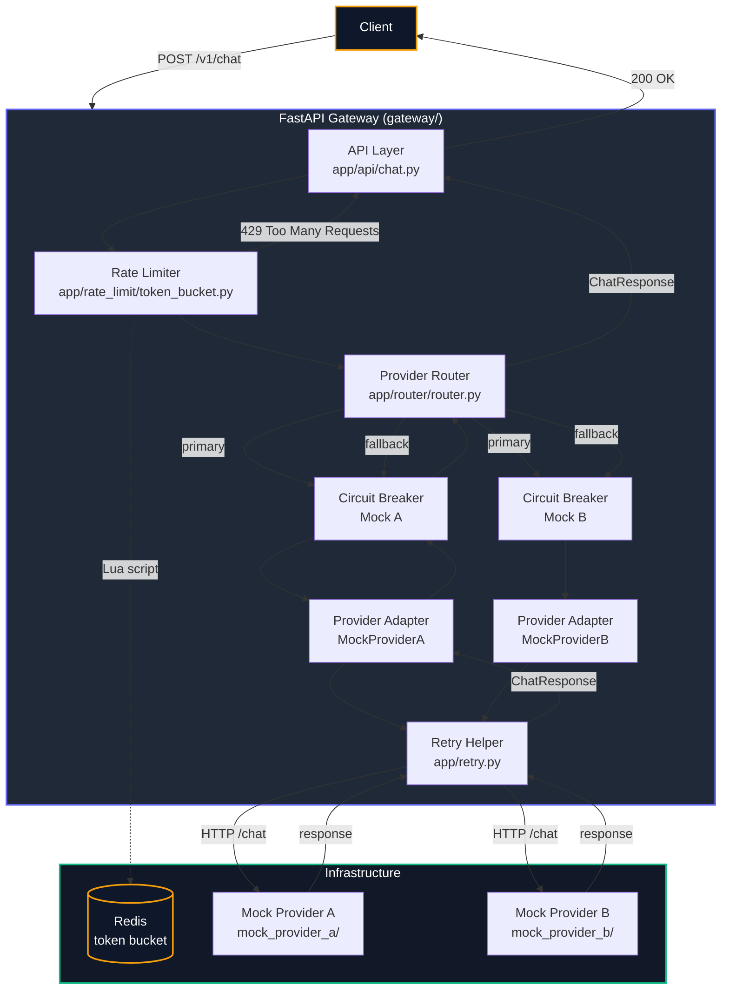

# LLM Gateway

A production-style **FastAPI LLM Gateway** that routes chat requests to upstream
LLM providers with enterprise-grade resilience patterns:

- **Smart provider routing** with automatic **fallback** when the primary provider fails
- **Circuit breaker** per provider (`CLOSED → OPEN → HALF_OPEN`) to stop hammering unhealthy providers
- **Retry logic** for transient failures (timeouts, connection errors, HTTP 5xx)
- **Redis-backed token-bucket rate limiting** (atomic Lua script, per-client IP)
- **Pluggable provider adapters** behind a shared abstract contract
- **Fully containerized** with Docker Compose + healthchecks

---

## Architecture

### How a request flows through the system



### Architecture diagram

```
┌──────────┐   POST /v1/chat   ┌──────────────────────────────────────────────────────────────┐
│  Client  │ ─────────────────▶ │                         FASTAPI GATEWAY                        │
└──────────┘                    │                                                                │
                                │  ┌────────────────────┐      ┌──────────────────────────┐      │
                                │  │   API Layer        │      │   Rate Limiter           │      │
                                │  │   api/chat.py      │ ───▶ │   token_bucket.py        │      │
                                │  └────────────────────┘      └────────────┬─────────────┘      │
                                │                                          │ allowed?             │
                                │                                          ▼ (yes)                │
                                │        ┌─────────────────────────────────┘   (no → 429)         │
                                │        ▼                                                       │
                                │  ┌────────────────────┐                                       │
                                │  │  Provider Router   │  primary / fallback                    │
                                │  │  router/router.py  │                                       │
                                │  └─────┬────────┬─────┘                                       │
                                │        │        │                                              │
                                │        ▼        ▼                                              │
                                │  ┌──────────┐ ┌──────────┐                                    │
                                │  │ Circuit  │ │ Circuit  │  CLOSED / OPEN / HALF_OPEN          │
                                │  │ Breaker A│ │ Breaker B│                                    │
                                │  └────┬─────┘ └────┬─────┘                                    │
                                │       │            │                                           │
                                │       ▼            ▼                                           │
                                │  ┌──────────┐ ┌──────────┐                                    │
                                │  │ Adapter  │ │ Adapter  │  BaseProvider contract              │
                                │  │ Mock A   │ │ Mock B   │                                    │
                                │  └────┬─────┘ └────┬─────┘                                    │
                                │       │            │                                           │
                                │       └─────┬──────┘                                           │
                                │             ▼                                                  │
                                │  ┌────────────────────┐                                       │
                                │  │   Retry Helper      │   max 2 retries on 5xx/timeout        │
                                │  │   retry.py          │                                       │
                                │  └─────────┬──────────┘                                       │
                                └────────────┼───────────────────────────────────────────────────┘
                                             │ HTTP /chat
                                             ▼
                        ┌────────────────────────────────────────────┐
                        │                DOCKER NETWORK               │
                        │                                            │
                        │  ┌──────────────────┐ ┌──────────────────┐ │
                        │  │ Mock Provider A  │ │ Mock Provider B  │ │
                        │  │ mock_provider_a/ │ │ mock_provider_b/ │ │
                        │  └──────────────────┘ └──────────────────┘ │
                        └────────────────────────────────────────────┘
                                             │
                                             ▼
                        ┌────────────────────────────────────────────┐
                        │                   REDIS                     │
                        │   token-bucket Lua script (atomic, per-IP)  │
                        └────────────────────────────────────────────┘
```

---

## 🔄 Request Lifecycle (step by step)

1. **Client sends** `POST /v1/chat` with a JSON body like `{"message": "Hello", "provider": "mock_a"}`.
2. **API layer** (`app/api/chat.py`) receives the request and asks the **rate limiter** for a token.
3. **Rate limiter** (`app/rate_limit/token_bucket.py`) runs an atomic **Lua script in Redis**.
   - Each client IP gets its own bucket (capacity `6`, refill `1` token/sec).
   - If the bucket is empty → responds `429 Too Many Requests` with `Retry-After` and `X-RateLimit-*` headers.
   - If Redis is unreachable → **fails closed** with `503` (no unthrottled paid traffic).
4. **Provider Router** (`app/router/router.py`) selects the **primary provider**:
   - `provider: "mock_a"` → Mock A primary, Mock B fallback (default)
   - `provider: "mock_b"` → Mock B primary, Mock A fallback
5. **Circuit breaker** (`app/circuit_breaker.py`) checks the primary provider's health:
   - `CLOSED` → allow the call.
   - `OPEN` (cooldown not expired) → skip to **fallback** immediately.
   - `HALF_OPEN` (cooldown expired, one test request running) → use fallback for new requests.
6. **Provider adapter** (`app/providers/mock_a.py` / `mock_b.py`) sends the message through the **retry helper**.
7. **Retry helper** (`app/retry.py`) calls the provider over Docker's internal network (`http://mock-provider-a:8000/chat`).
   - **2 retries** on timeouts, connection errors, and HTTP 5xx.
   - **No retry** on HTTP 4xx (client errors).
8. **On success** → `record_success()` closes the circuit, resets failure count, and the `ChatResponse` travels back up to the client as `200 OK`.
9. **On failure** (5xx / timeout / connection) → `record_failure()` increments the counter:
   - After **3 failures** (default) → circuit **opens** for **10 seconds** (default), then goes `HALF_OPEN`.
   - The router **switches to the fallback provider**.
   - If the fallback also fails → `502 Bad Gateway` ("Both the primary and fallback providers failed.").

---

## 📁 Project Structure

```
llm-gateway/
├── docker-compose.yml              # Orchestrates redis + providers + gateway
├── gateway/                        # The LLM Gateway service
│   ├── Dockerfile
│   ├── requirements.txt
│   └── app/
│       ├── main.py                 # FastAPI entry point (/health, mounts /v1)
│       ├── config.py               # Pydantic settings (env-driven)
│       ├── schemas.py              # ChatRequest / ChatResponse models
│       ├── cache.py                # Redis client + get/set cache helpers
│       ├── circuit_breaker.py      # Per-provider circuit breaker state machine
│       ├── retry.py                # Retry helper for provider calls
│       ├── api/
│       │   └── chat.py             # POST /v1/chat endpoint + rate limiting
│       ├── providers/
│       │   ├── base.py             # Abstract BaseProvider contract
│       │   ├── mock_a.py           # Adapter for Mock Provider A
│       │   └── mock_b.py           # Adapter for Mock Provider B
│       ├── rate_limit/
│       │   └── token_bucket.py     # Redis token-bucket (atomic Lua script)
│       └── router/
│           └── router.py           # Primary/fallback selection + circuit logic
├── mock_provider_a/                # Mock LLM provider A (standalone FastAPI)
│   ├── Dockerfile
│   ├── requirements.txt
│   └── main.py                     # /chat → {"provider": "mock_a", ...}
└── mock_provider_b/                # Mock LLM provider B (standalone FastAPI)
    ├── Dockerfile
    ├── requirements.txt
    └── main.py                     # /chat → {"provider": "mock_b", ...}
```

---

## Quick Start

### With Docker Compose (recommended)

```bash
docker compose up --build
```

This starts **four** services with healthchecks:

| Service             | Port        | Purpose                                   |
| ------------------- | ----------- | ----------------------------------------- |
| `gateway`           | `8000`      | LLM Gateway API                           |
| `mock-provider-a`   | internal    | Mock LLM provider A                       |
| `mock-provider-b`   | internal    | Mock LLM provider B                       |
| `redis`             | internal    | Token-bucket rate limiting                |

The gateway is available at `http://localhost:8000` and its health endpoint is
`GET /health`.

### Run locally (without Docker)

From the `gateway/` directory:

```bash
pip install -r requirements.txt
uvicorn app.main:app --reload
```

> **Note:** The default provider URLs point to Docker Compose service names
> (`http://mock-provider-a:8000`). For a fully local run, override them with
> environment variables, e.g. `PROVIDER_A_URL=http://localhost:9001` and
> `PROVIDER_B_URL=http://localhost:9002`, and make sure Redis is reachable.

---
